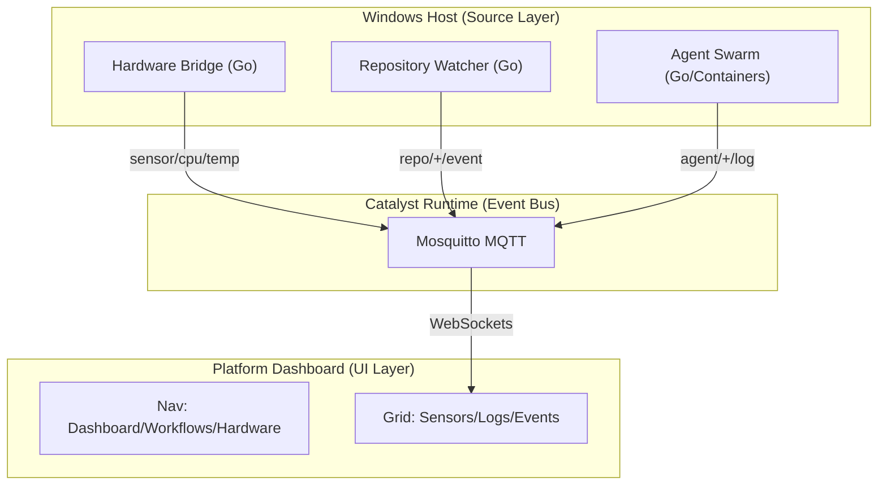

# Catalyst
> **The Autonomous Open Source Maintenance Platform.**

> 🚀 **Catalyst MVP 1.0 (Swarm Activated)**

## 📚 Centralized Documentation Index

### 👩‍💻 User Resources
- **[Deployment & Usage Guide](#-development-workflow)**: How to install, run, and manage Catalyst.
- **[Frontend Documentation](ui/README.md)**: UI/UX specifics, components, and theming.

### 🤖 Developer & Agent Resources
- **[System Architecture](docs/ARCHITECTURE.md)**: Core design, Hexagonal Architecture, and Data Flow.
- **[Agent Swarm Protocol](AGENTS.md)**: Agent Personas, Roles, and Interaction Rules.
- **[Engineering Standards](docs/STANDARDS.md)**: Coding conventions, CloudEvent schemas, and Telemetry standards.
- **[Vector & Swarm Design](docs/swarms.md)**: RAG integration and Swarm Intelligence design.
- **[UI Architecture](UI_ARCHITECTURE.md)**: Frontend Component hierarchy and State Management.
- **[K8s Isolation ADR](docs/adr-001-k8s-isolation.md)**: Decision record for Zero Trust Architecture.

## 🌍 Global Architecture State
**Current Phase:** "Phase 5: Swarm Intelligence & refined UI"
**Status:** ✅ Infrastructure Stable | ✅ UI Refactored | 🔄 Agent Swarm Active
**Last Snapshot:** 2026-01-21 (State Verified, Clean Tree)

### 🚀 Current Capabilities
- **Frontend**: **Hybrid Light/Dark Theme** ("SaaS Professional") with Real-Time Telemetry.
- **Backend**: Fully Containerized Go Architecture (Hexagonal) with RAG-enabled "Vibe Engine".
- **Infrastructure**: "Zero Trust Local" via standard Kind Kubernetes cluster.
- **Workflow**: Automated `Makefile` standards for Rapid/Hybrid development.

### 🏗️ Design Reference (The "Architecture Constraint")
All functional components MUST adhere to this topology:



---

## 🤖 The Delivery Swarm (MVP 1.0)
We utilize a virtual "Swarm" of specialized agent personas to execute this project.
**See `AGENTS.md` for detailed functional specs.**

### 1. `Interface` (The Frontend Architect)
*   **Role**: Frontend Engineering & UX.
*   **Mission**: Deliver a **High-Visibility "Industrial Slate"** control plane optimized for monitoring hardware.
*   **Tech Stack**: React 19, Vite, Tailwind CSS (Slate Palette), Framer Motion.
*   **Directives**: "Visualize everything. Reduce cognitive load."

### 2. `Orchestrator` (The Backend Engineer)
*   **Role**: Core Systems Engineering.
*   **Mission**: Build a fault-tolerant, high-concurrency event bus and orchestrator.
*   **Tech Stack**: Go (Golang), Eclipse Mosquitto (MQTT), PostgreSQL (Persistence).
*   **Directives**: "The Event Bus is the source of truth."

### 3. `Infrastructure` (DevOps & Site Reliability)
*   **Role**: Infrastructure-as-Code (IaC) & K8s.
*   **Mission**: Maintain the `kind` cluster, Docker resources, and self-hosted environments.
*   **Tech Stack**: Kubernetes, Helm, Docker, Cygwin/Make.

### 4. `Simulation` (Data Generation)
*   **Role**: Chaos Engineering.
*   **Mission**: Emulate hardware sensors and swarm activity for development (`device-mock`).
*   **Status**: Active (Emitting `agent/+/log` and `sensor/cpu/temp`).

### 5. `Watcher` (Repository Monitor)
*   **Role**: Source Control Intelligence.
*   **Mission**: Poll GitHub repositories for Pull Requests, Issues, and Pushes.
*   **Features**:
    *   **Smart Polling**: Stateful Change Detection (No polling spam).
    *   **Rich Events**: Distinguishes between `repo.push`, `repo.pr`, and `repo.issue`.
### 6. `Liaison` (Head of Communications)
*   **Role**: Human-Swarm Interface.
*   **Mission**: Interpret natural language intent and execute tool calls.
*   **Capabilities**: `git_create_issue`, `pipeline.run`.
*   **Status**: Active (`core` internal agent).

### 7. `PipelineArchitect` (CI/CD Specialist)
*   **Role**: Pipeline Engineering.
*   **Mission**: Create, Manage, and Execute GitHub Workflows.
*   **Capabilities**: `pipeline.list`, `pipeline.read`, `pipeline.save`, `pipeline.run`.
*   **Status**: Active (`core` internal agent).

---

## 🧠 Phase 5: The Vibe Engine (Swarm Intelligence)
The `catalyst-core` service is the central nervous system, built on a **Hexagonal Architecture**.

### 1. The Hexagonal Core
*   **Domain Layer** (`internal/domain`): [x] Contracts Defined (`cloudevent`, `Agent`).
*   **Adapters** (`internal/adapter`):
    *   **EventBus**: [x] MQTT Client (Paho) Connected.
    *   **Store**: [x] Postgres Persistence (pgvector ready).
    *   **LLM**: [x] OpenAI/Ollama Adapter (RAG Integration).
*   **Service Layer** (`internal/service`):
    *   **MissionManager**: [x] Routing Logic Verified.
    *   **AgentRegistry**: [x] Plugin Loading (Concurrency Safe).
    *   **GroupChatManager**: [x] Conversational Orchestrator.
    *   **VibeEngine**: [x] Vector Recall & Code Indexing.
*   **Shared SDK** (`pkg/`):
    *   **CloudEvent**: Unified Data Protocol.
    *   **Logger**: Standardized JSON Logging.
    *   **MCP**: Catalyst Tool Protocol (Model Context Protocol).
    *   **Vector**: Embeddings & Similarity Search.

### 2. The Hive Mind (Agent Swarm)
We utilize a virtual "Hive Mind" of specialized agent personas:
*   **SystemArchitect**: Governance & OrgPolicy Enforcement (Read-Only).
*   **SoftwareEngineer**: Vibe Coding & Feature Implementation (R/W).
*   **PipelineArchitect**: CI/CD & Workflow Management.
*   **InfrastructureManager**: K8s & Helm Operations.
*   **Liaison**: Human-Swarm Interface (ChatOps).

---

## 🛡️ Secure Self-Hosted Architecture

Catalyst is architected for **Zero Trust Local** execution.

*   **Isolation**: Services run in strictly isolated containers (Docker).
*   **Ingress Control**: No direct port exposure. Traffic flows through a Reverse Proxy.
*   **Least Privilege**: Strict ACLs on the MQTT Broker.

### 🛠️ Development Workflow
We adhere to a standardized `Makefile` workflow.

**Prerequisites**: Docker Desktop, Go 1.22+, Node.js 20+, Kind, Helm.

```bash
# 1. Install Dependencies & Tools
make install

# 2. Standards Verification (Run before PRs)
make sdk-check

# 3. Start Infrastructure (K8s + Helm)
# Deploys Postgres (pgvector), Mosquitto, and Observability
make cluster-up 

# 4. Start Application Stack (Localhost)
# Launches UI (localhost:5173), Core Service, Device Mock, and Repo Watcher
make dev

# 5. Infrastructure Management
make cluster-up   # Start Kind Cluster (DB/Broker)
make cluster-down # Destroy Cluster

### Option A: Hybrid Development (Recommended)
Run infrastructure in Kubernetes, but application code locally for fast iteration.
1.  **Start Infrastructure**: `make cluster-up`
2.  **Start Services**: `make dev` (UI/Mocks) and `make core` (Brain).
3.  **Access UI**: http://localhost:5173

### Option B: Full Cluster Deployment
Run everything inside Kubernetes.
1.  **Build & Load Images**: `make load-images`
2.  **Deploy Stack**: `make cluster-up`
3.  **Access UI**: http://localhost:30080 (via NodePort)

## 6. Access & Observation
- **Mission Control (UI)**:
    - Hybrid: http://localhost:5173
    - Cluster: http://localhost:30080
- **Grafana**: http://localhost:3000 (Monitoring)

# 7. LLM Configuration (Optional)
# Defaults:
# LLM_ENDPOINT=http://localhost:11434/v1
# LLM_MODEL=qwen2.5-coder:7b-instruct
# PRIVATE_MODE=true
#
# To override (e.g. for different model):
# Set-Item -Path Env:LLM_MODEL -Value "llama3:8b"
# make core
```

---

## 📂 Repository Structure
*   `/pkg`: **Catalyst SDK** (Shared Libraries for Events/Logs/MCP/Vector).
*   `/ui`: The React Frontend Application (`Interface`).
*   `/core`: The central Go Orchestrator (`Orchestrator`) with RAG.
*   `/bin`:
    *   `device-mock`: Hardware simulator (`Simulation`).
    *   `repo-watcher`: GitHub connectivity & Code Indexing (`Watcher`).
*   `/deploy`:
    *   `/charts`: Helm Charts for Infrastructure.
*   `/docs`: Architecture Decision Records (ADRs).
