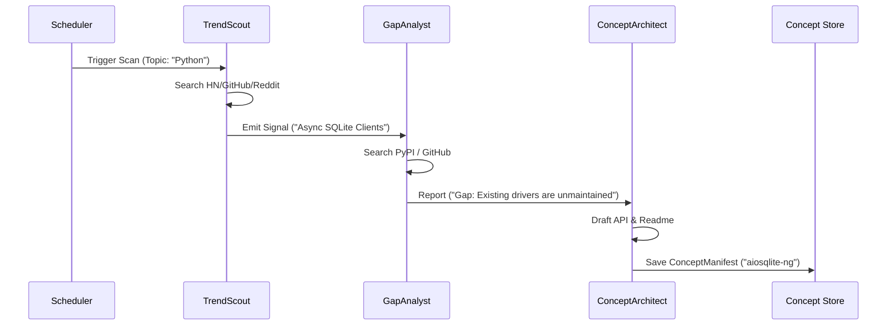

# Deleggit Agent Swarms

## Discovery Swarm (001)

The Discovery Swarm is the "Concept Engine" of Deleggit. It proactively monitors the software ecosystem to identify high-value opportunities for new libraries or tools.

### Architecture: The "Research Loop"
Unlike a standard chat-bot, this swarm operates as a specialized pipeline of three distinct Agent personas.

#### 1. Agent: TrendScout
*   **Role**: Signal Detection & Gathering.
*   **Behavior**: Scans external sources for recurring pain points or exciting new technologies.
*   **Key Question**: "What are developers complaining about or getting excited about *right now*?"
*   **Outputs**: `TrendSignal` (Topic, Source, Intensity Score).

#### 2. Agent: GapAnalyst
*   **Role**: Market Fit & Validation.
*   **Behavior**: Takes a `TrendSignal` and cross-references it with existing package registries (PyPI, NPM, Crates, Maven).
*   **Key Question**: "Does a high-quality, maintained solution already exist for this problem?"
*   **Outputs**: `GapReport` (Verdict: SATURATED | GAP_FOUND | UNDERSERVED).

#### 3. Agent: ConceptArchitect
*   **Role**: Solution Design.
*   **Behavior**: Generates the "Pitch" for the missing tool.
*   **Key Question**: "If we built this, what would the API look like? What is the 'Killer Feature'?"
*   **Outputs**: `ConceptManifest` (JSON schema including Name, Description, Proposed API).

### Data Flow

